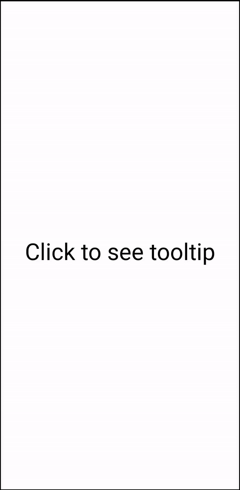

# Light-Weight React Native Tooltip

A smooth & cross-platfrom tooltip component for React Native. A light weight library that is highly customisable and can be used without any performance drop. It is a non-modal based solution.

## Table of Contents

- [Installation](#installation)
- [Quickstart](#quickstart)
- [Behaviour](#behaviour)
- [Demo](#demo)
- [Props](#props)
- [How it works](#how-it-works)

## Installation

```console
npm install rn-lightweight-tooltip
```

or

```console
yarn add rn-lightweight-tooltip
```

## Quickstart

Enable the Tooltip feature by wrapping your root component with `<TooltipProvider>` at the App level.
Wrap the component for which you want tooltip functionality with `<Tooltip>`. Pass appropriate props.

```javascript
import { TooltipProvider, Tooltip } from "rn-lightweight-tooltip";

const App = () => {
  return (
    <TooltipProvider>
      <View>
        <Text>Tooltip example</Text>
        <Tooltip
          popover={<Text> This is a tooltip. Click outside to dismiss.</Text>}
          backgroundColor={"aqua"}
          customContainerStyle={styles.customContainerStyle}
        >
          <Text>Click on me to see tooltip</Text>
        </Tooltip>
      </View>
    </TooltipProvider>
  );
};

export default App;

const styles = StyleSheet.create({
  customContainerStyle: { borderRadius: 10, padding: 5 },
});
```

## Behaviour

If the user will click on the `<Text>` component, the tooltip will be shown with the given component in `popover` props.
The Tooltip UI can also be modified via `customContainerStyle` props.
Now, if touched anywhere on the screen, the Tooltip will hide.

## Demo

 

## Props

| Prop Name            | Type            | Default value            | Description                                                                                                         |
| -------------------- | --------------- | ------------------------ | ------------------------------------------------------------------------------------------------------------------- |
| popover              | JSX.element     | <></>                    | The tooltip component which is shown when user clicks on the component wrapped under Tooltip.                       |
| customContainerStyle | React.ViewStyle | {backgroundColor:'white} | The style of the container which covers the popover component                                                       |
| backgroundColor      | String          | 'white'                  | Background color of the container which covers the popover component                                                |
| offsetHorizontal     | Number          | 0                        | Used to adjust the position of the tooltip horizontally. A positive offset will shift the tooltip towards the right |
| tooltipArrowOffset   | Number          | 25                       | The distance of the arrow from the left-most end of the popover container                                           |
| arrowHeight          | Number          | 8                        | The height of the arrow which points towards the clickable component.                                               |
| zIndex               | Number          | 999999                   | The z-Index of the popover component                                                                                |

## How it works

When the user clicks on the wrapped component, the absolute position of the component is calculated using React native's [measure](https://facebook.github.io/react-native/docs/direct-manipulation.html#measurecallback). An event is triggered which passes this position along with other props to the TooltipProvider component which operates at the app level. Here we render the tooltip at the specified position and detect for any touches on the screen. We dismiss the tooltip whenever any such touch is detected.
